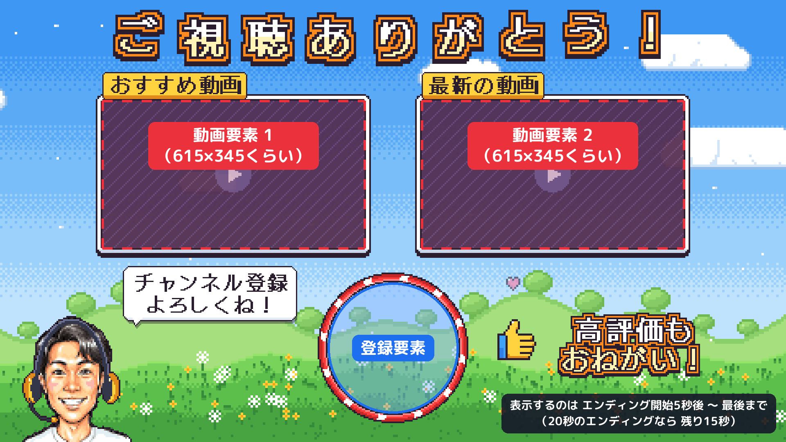

# せくぬゆ エンディング動画

YouTubeチャンネル「せくぬゆ」用のエンディング動画です。
HikakinGames の冒頭演出（ドット絵のゲームマップ → アバター登場 → ロゴがドンッ！）の雰囲気を参考にした、
オリジナルのドット絵エンディングになっています。



## できあがったファイル（`output/`）

| ファイル | 内容 |
| --- | --- |
| `sekunuyu_ending.mp4` | エンディング本体（20秒・1920×1080・30fps・BGM／効果音つき） |
| `sekunuyu_opening.mp4` | おまけ：ロゴ演出だけのオープニング（約4秒） |
| `endscreen_guide.png` | YouTube の終了画面要素をどこに置くかのガイド画像 |

## エンディングの流れ

| 時間 | 演出 |
| --- | --- |
| 0.0〜0.8秒 | 雲がパカッと開いて、ドット絵のワールドマップ |
| 0.35秒 | ヘッドセット姿のドット絵アバターがポンッと登場 |
| 1.1秒 | 「せくぬゆ」ロゴがドンッ！と着地（画面が揺れて、星やコインがはじける）→ ファンファーレ |
| 1.3秒 | 「GAME CHANNEL」のリボン |
| 2.0秒 | ロゴがキラーンと光る |
| 3.6〜4.8秒 | 雲で場面転換 → 青空とたんぽぽの草原（チャンネルバナーのイメージ） |
| 4.4秒〜 | 「ご視聴ありがとう！」、動画枠×2、登録ボタンの枠、アバター、吹き出し、高評価 |
| 8.0秒・13.2秒 | カーソルが登録ボタンをポチッ |
| 17.1秒 | 「また見てね！」「バイバーイ！」に切り替え |
| 18.7〜20秒 | 最後のジャーン |

## 使い方

### 1. 動画の最後につなげる

CapCut や Premiere などで、本編の最後に `sekunuyu_ending.mp4` をつなげます。
BGM の音量は -16 LUFS くらいにしてあるので、声を乗せるときは BGM を少し下げるとちょうどいいです。

セリフを入れるなら、こんなタイミングがおすすめです。

| 時間 | セリフ例 |
| --- | --- |
| 4〜6秒 | 「ご視聴ありがとうございました！」 |
| 6〜9秒 | 「チャンネル登録と高評価、よろしくお願いします！」 |
| 17秒〜 | 「それじゃあまたね！バイバーイ！」 |

### 2. YouTube Studio で終了画面を設定する

1. YouTube Studio →「コンテンツ」→ 動画の「詳細」→ 右側の「終了画面」
2. 「要素」から次の3つを追加
   - 動画 ×2（例：「最新のアップロード」と「視聴者に適したコンテンツ」）
   - 登録 ×1
3. `endscreen_guide.png` のとおり、動画要素は四角い枠の中、登録要素は赤い丸の中に置く
   （動画要素は約615×345、登録要素は約294×294。どちらも枠の中に収まるサイズで作ってあります）
4. 表示時間は **エンディングが始まってから5秒後〜最後まで**（最後の15秒）にする

終了画面は「動画の最後の5〜20秒」にしか置けず、25秒未満の動画では使えません。

## 素材について

- 絵（マップ・アバター・ロゴ・画面の部品）：このスクリプトで描いたオリジナルのドット絵です。
  アバターはチャンネルアイコンを切り抜いてドット絵に変換したものです。
- 曲・効果音：プログラムで作曲・合成したオリジナルなので、収益化した動画でも使えます。
- フォント：DotGothic16 / M PLUS Rounded 1c / Press Start 2P（どれも SIL Open Font License で、商用利用OK）
- 参考にしたのは演出の雰囲気だけで、HIKAKIN さんのロゴ・キャラクター・曲は使っていません。

## 作り直すとき

```sh
pip install -r requirements.txt   # Pillow / numpy / scipy
sudo apt install ffmpeg
python3 make_ending.py            # output/ に3つとも書き出し（1分くらい）
python3 make_ending.py --preview  # 確認用の静止画だけ書き出す
```

- 文言を変えたい：`make_ending.py` の `TEXT`
- タイミングを変えたい：`lib/timeline.py`
- 高画質のアイコンで作り直したい：背景を透過した PNG を用意して
  `python3 make_ending.py --avatar 画像.png`
- フォントは初回実行時に Google Fonts から自動でダウンロードします。

| ファイル | 役割 |
| --- | --- |
| `make_ending.py` | タイムラインどおりに全フレームを描いて ffmpeg で書き出す |
| `lib/world.py` | ワールドマップ・雲・青空と草原 |
| `lib/avatar.py` | アイコン → ドット絵アバター（ヘッドセット付き） |
| `lib/ui.py` | ロゴ・テロップ・動画枠・登録ボタン枠・吹き出しなど |
| `lib/chiptune.py` / `lib/soundtrack.py` | ファミコン風の音源と、BGM・効果音の配置 |
| `lib/timeline.py` | 映像と音で共有するタイミング（150BPM） |
