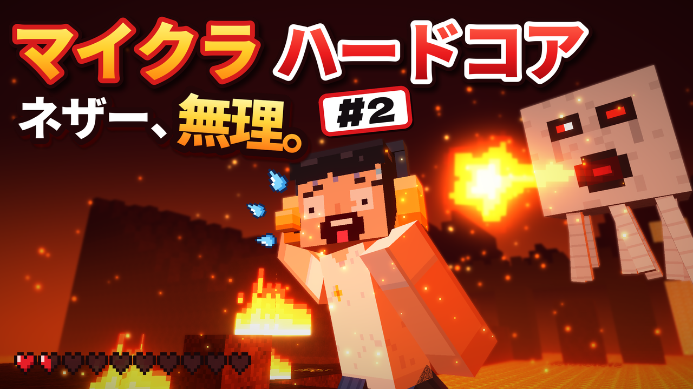

# せくぬゆ サムネイル（マイクラ ハードコア #2）

YouTubeチャンネル「せくぬゆ」の「マイクラ ハードコア #2（ネザー探検）」用のサムネイルです。



## できあがったファイル（`output/`）

| ファイル | 内容 |
| --- | --- |
| `thumbnail_02.png` | サムネイル（1280×720） |
| `thumbnail_02.jpg` | 同じもののJPG版（約180KB。YouTubeの上限2MBに余裕で収まる） |

YouTube Studio →「コンテンツ」→ 動画の「詳細」→「サムネイル」→「ファイルをアップロード」で設定できます。

## デザイン

- **シリーズ感**：上の「マイクラ ハードコア」は #1 と同じ配置と配色（黄色＋赤、太いフチ）
- **キャッチ**：「ネザー、無理。」（#1 の「死んだら、終わり。」と同じリズム）＋「#2」バッジ
- **キャラ**：せくぬゆ仕様のマイクラ風キャラ（黒髪・白T・エンディングと同じ黄色いヘッドセット）が、
  目を見開いて絶叫しながら逃げている。汗も飛び散らせて焦り感を強調
- **舞台**：ネザー（溶岩の海、ネザーラック、燃える炎、ネザー要塞のシルエット、火の粉）
- **敵**：ガストが撃った火の玉が、頭のすぐ横まで迫っている
- **体力**：ハートが残り1.5個で「大ピンチ」

## 作り直すとき

```sh
pip install -r requirements.txt   # Pillow / numpy / scipy
python3 make_thumbnail.py            # output/ に書き出し（30秒くらい）
python3 make_thumbnail.py --preview  # 等倍ですばやく確認（10秒くらい）
```

- 文字を変えたい（例：`#2` → `2日目`）：`make_thumbnail.py` の `TEXT`
- ポーズ・カメラ・ガストや火の玉の位置：`make_thumbnail.py` の `Scene`
- 表情：`lib/textures.py` の `FACE_SCREAM`（16×16 のドット絵）
- フォントは初回実行時に Google Fonts から自動でダウンロードします。

| ファイル | 役割 |
| --- | --- |
| `make_thumbnail.py` | 地形・キャラ・ガストを配置して描画し、霧・発光・ぼかし・文字を重ねる |
| `lib/voxel.py` | ブロックを描く小さな 3D レンダラー（Zバッファ、テクスチャ、ライト） |
| `lib/world3d.py` | ネザーの地形（ボクセル）から見える面だけを取り出す |
| `lib/models.py` | せくぬゆ（プレイヤー）とガストの 3D モデル、ポーズ |
| `lib/textures.py` | ブロック・キャラ・ガスト・炎のドット絵テクスチャ |
| `lib/overlay.py` | フチ取り文字、ハート、バッジ、汗 |

## 素材について

- 絵はすべてこのスクリプトで描いたオリジナルです（ブロックの模様・キャラ・ガストもプログラムで作ったドット絵）。
- フォント：Noto Sans JP Black / Dela Gothic One（どちらも SIL Open Font License で、商用利用OK）
